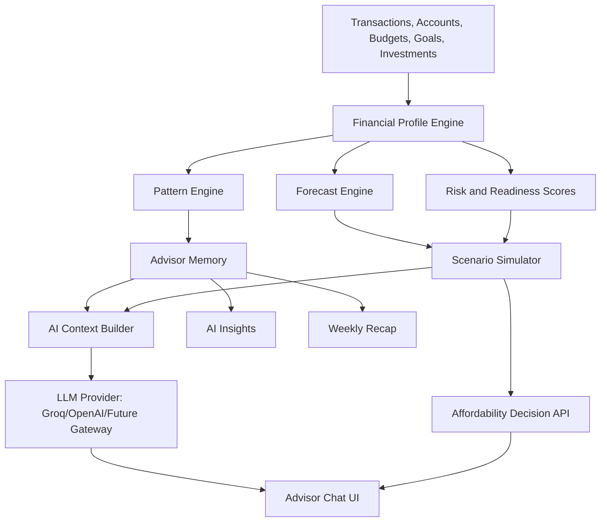

# FinBrain Monarch-Quality Product and Personal Advisor Implementation Plan

> Created: 2026-07-20  
> Branch: `feat/monarch-advisor-implementation-plan`  
> Goal: Bring FinBrain to Monarch Money-level product quality, then surpass it with a deeply personalized financial advisor that learns each user's income, expense, spending, saving, debt, and investing patterns.

---

## 1. Product Target

FinBrain should become a production-ready personal finance platform that a real user can trust as their daily money command center.

The benchmark is Monarch Money-level quality, not a visual or code clone. The goal is equivalent or better product quality across:

- Account aggregation and syncing
- Transaction tracking
- Categorization
- Budgets
- Goals
- Recurring bills and subscriptions
- Cash flow and forecasting
- Net worth
- Investments
- Reports
- Couples and household collaboration
- Mobile experience
- AI assistant, insights, and weekly recaps
- Security, reliability, privacy, and polish

FinBrain's differentiator must be the **Personal Financial Advisor Layer**:

> A user can ask: "I am thinking of buying an iPhone 17 Pro Max. Is that a good financial decision right now?"  
> FinBrain should answer with a personalized decision using the user's actual income, bills, cash flow, savings rate, goals, emergency fund, debts, investments, and future projections.

---

## 2. Current Codebase Reality

This plan was created after inspecting the current repository.

### Markdown files inspected

- `AGENTS.md`
- `README.md`
- `CHANGELOG.md`
- `docs/FEATURE_ROADMAP.md`
- `docs/SPRINTS.md`

### Current API routes

Current routes in `apps/api/src/routes`:

- `accounts.ts`
- `ai.ts`
- `auth.ts`
- `budgets.ts`
- `categories.ts`
- `currency.ts`
- `forecast.ts`
- `goals.ts`
- `health.ts`
- `import.ts`
- `investments.ts`
- `notifications.ts`
- `plaid.ts`
- `receipts.ts`
- `recurring.ts`
- `rules.ts`
- `search.ts`
- `seed.ts`
- `transactions.ts`

### Current web pages

Current pages in `apps/web/src/pages`:

- `accounts.tsx`
- `analytics.tsx`
- `budgets.tsx`
- `categories.tsx`
- `dashboard.tsx`
- `forecasting.tsx`
- `goals.tsx`
- `help.tsx`
- `home.tsx`
- `insights.tsx`
- `investments.tsx`
- `onboarding.tsx`
- `receipts.tsx`
- `recurring.tsx`
- `reports.tsx`
- `rules.tsx`
- `settings.tsx`
- `transactions.tsx`

### Current Prisma models

Current schema includes:

- `User`
- `Category`
- `Account`
- `Transaction`
- `Budget`
- `BudgetHistory`
- `Goal`
- `GoalContribution`
- `Forecast`
- `Recommendation`
- `FinancialHealth`
- `Receipt`
- `Notification`
- `AuditLog`
- `CategorizationRule`
- `Portfolio`
- `Holding`

### Current completed strengths

The project already has a strong base:

- Full-stack monorepo with React/Vite, Express, Prisma, PostgreSQL, FastAPI ML service.
- Clerk authentication with dev fallback.
- Transaction CRUD, categories, accounts, budgets, goals, analytics, reports.
- Plaid sandbox sync.
- CSV import.
- German bank PDF parser.
- Receipt OCR.
- Multi-currency support.
- XLM-RoBERTa categorization model documented at 86.5% accuracy and 86.34% F1.
- Groq/OpenAI LLM integration in `apps/api/src/routes/ai.ts`.
- AI context endpoint.
- Investments page and holdings models.
- Notifications and budget alerts.
- Forecasting models and forecasting page.
- Sankey reports and PDF export.
- Responsive shell with dashboard and global search.

### Current important gaps

The current product is not yet Monarch-quality for real production users because it still lacks:

- Deep advisor memory and user pattern learning.
- Deterministic affordability and scenario calculations.
- Persistent AI conversations and feedback loops.
- Weekly recap generation.
- AI insight generation on each important screen.
- Household/couples shared finance system.
- Shared views: yours, mine, ours.
- Flex budgeting.
- Recurring calendar view and bill reminders.
- Credit score tracking.
- Real investment market data, performance history, and top movers.
- Account connection health dashboard and multi-provider sync.
- Production-grade onboarding, trial/subscription/billing, and deployment.
- Monitoring, Sentry, structured logs, uptime checks.
- Security/privacy documentation and AI opt-out controls.
- E2E tests, reliable CI gates, and seed/demo scenarios.
- Mobile app or high-quality PWA/offline support.
- Documentation cleanup. Some existing roadmap docs are stale.

---

## 3. Process Rules To Follow

These rules come from `AGENTS.md` and must be followed for all implementation work.

### Branching

- Do feature work on `feat/*` branches.
- Merge tested work into `dev`.
- Merge `dev` to `main` only at stable release milestones.

### Dev server cleanup

Always kill dev servers after testing:

```bash
kill $(lsof -t -i :4000) 2>/dev/null
kill $(lsof -t -i :5173) 2>/dev/null
```

Also stop ML service on port `8000` if manually started.

### Prisma

Use:

```bash
npx prisma db push
```

Do not use interactive `prisma migrate dev` in automation.

### Commit rules

- Commit logical changes as work progresses.
- Keep commit messages concise and imperative.
- Do not add co-authors.
- Do not include `AGENTS.md` in commits to `dev` or `main`.

### Current repo hygiene issue

`AGENTS.md` is currently tracked by git, even though the file says it must be local-only and never pushed to `dev` or `main`. This should be fixed on a separate cleanup branch after confirming the desired git history behavior.

---

## 4. Monarch Benchmark Summary

Public Monarch references emphasize these product areas:

- All accounts in one place: bank accounts, credit cards, loans, real estate, investments.
- Transactions in one clean searchable list.
- Budgeting that flexes to the user's life.
- Partner collaboration and shared views.
- Goals and cash flow planning.
- Recurring subscriptions and bill visibility.
- Reports and customizable charts.
- Web, iOS, and Android sync.
- Multiple financial data providers and 13,000+ institutions.
- AI Assistant, AI-powered Insights, and Weekly Recap.
- Forecasting for retirement, home buying, career breaks, and other life decisions.
- Credit score tracking.
- SOC 2 and privacy/security posture.

Official references used:

- <https://www.monarch.com/>
- <https://help.monarch.com/hc/en-us/articles/16116906962452-About-Monarch-s-AI-Features>
- <https://www.monarch.com/whats-new>

---

## 5. North Star User Experience

### Daily use

A user opens FinBrain and immediately sees:

- Net worth and cash available.
- This month income, spending, and savings rate.
- Budget health.
- Upcoming bills and subscriptions.
- Goal progress.
- Important anomalies.
- A short AI-generated summary of what changed.
- Advisor prompts that are specific to the user's situation.

### Ask advisor example

User asks:

> I am thinking of buying an iPhone 17 Pro Max. Is it a good financial decision right now?

FinBrain should respond with:

- Clear answer: Good idea, wait, or not recommended.
- Confidence level.
- Expected purchase amount and assumptions.
- Current cash buffer.
- 30/60/90-day projected balance before and after purchase.
- Emergency fund impact.
- Savings rate impact.
- Goal delay impact.
- Budget impact.
- Debt or credit card risk.
- Investment impact if relevant.
- Safer alternatives.
- Follow-up options such as "simulate buying next month" or "compare cash vs financing".

### Advisor standard

The advisor must not be just an LLM prompt. It needs a deterministic financial calculation layer plus LLM explanation.

Architecture rule:

```txt
Financial data -> deterministic analysis -> structured decision object -> LLM explanation -> cited numbers and actions
```

---

## 6. Target Architecture



---

## 7. Implementation Phases

## Phase 0 - Documentation and Product Truth Cleanup

### Goal

Make docs match the real codebase so future work is not based on stale status.

### Tasks

1. Update `README.md` feature table.
   - Remove duplicate planned rows for features already completed.
   - Mark forecasting, Sankey, PDF export, and cash flow projection as complete.
   - Clarify which features are complete vs partial.

2. Update `docs/FEATURE_ROADMAP.md`.
   - Mark Wave 1 and Wave 2 items that are now implemented.
   - Keep remaining gaps accurate.
   - Replace "Industry Standard" wording with "Monarch benchmark" where appropriate.

3. Update `docs/SPRINTS.md`.
   - Add status notes that old unchecked items are partially superseded.
   - Keep historical sprint plan but add a current-state addendum.

4. Decide how to handle tracked `AGENTS.md`.
   - Option A: remove from git index and add to `.git/info/exclude` or `.gitignore`.
   - Option B: keep it intentionally tracked and revise instruction.
   - Recommended: confirm with project owner before changing because it affects repo policy.

### Acceptance criteria

- New contributor can read docs and correctly understand current status.
- No completed feature is still shown as only planned.
- No local-only file is accidentally included in a production branch commit.

---

## Phase 1 - Production Data Integrity Foundation

### Goal

Before adding advisor intelligence, make financial data trustworthy. Bad data means bad advice.

### Backend tasks

1. Normalize amount semantics.
   - Current code stores some expenses as negative values and uses `Math.abs()` in many places.
   - Create a single convention:
     - `Transaction.type = expense` means outflow.
     - `Transaction.amount` should preferably be positive absolute amount.
     - Derived signed amount should be computed in helpers.
   - Add utility functions:
     - `getTransactionAmountAbs(transaction)`
     - `getTransactionSignedAmount(transaction)`
     - `sumIncome(transactions)`
     - `sumExpenses(transactions)`

2. Add database-level data quality fields.
   - `Transaction.reviewed Boolean @default(false)`
   - `Transaction.needsReview Boolean @default(false)`
   - `Transaction.originalName String?`
   - `Transaction.pending Boolean @default(false)`
   - `Transaction.externalId String?`
   - `Transaction.accountId` already exists.
   - Add indexes for external sync dedupe.

3. Create `apps/api/src/services/finance-math.ts`.
   - Centralize calculations for income, expenses, net, savings rate, runway, debt ratio.
   - Use this across dashboard, reports, analytics, AI, and forecasting.

4. Create `apps/api/src/services/data-quality.ts`.
   - Detect duplicate transactions.
   - Detect missing categories.
   - Detect unknown merchants.
   - Detect suspicious amounts.
   - Detect stale account sync.

5. Add API endpoint:
   - `GET /api/v1/data-quality/summary`
   - `POST /api/v1/data-quality/fix/common`

### Frontend tasks

1. Add reviewed state to Transactions page.
2. Add "Needs review" filter.
3. Add data quality widget on dashboard.
4. Add first-run message when there is not enough data for advisor-quality answers.

### Acceptance criteria

- All financial calculations use shared finance math helpers.
- Dashboard, reports, analytics, and AI agree on totals.
- User can see whether data is complete enough for reliable advice.
- Advisor refuses high-confidence answers when data is insufficient.

---

## Phase 2 - Advisor Data Model and Memory Layer

### Goal

Give FinBrain durable user-specific knowledge that updates as transactions change.

### New Prisma models

Add these models to `apps/api/prisma/schema.prisma`:

```prisma
model AdvisorProfile {
  id                    String   @id @default(cuid())
  userId                String   @unique
  user                  User     @relation(fields: [userId], references: [id], onDelete: Cascade)

  dataStartDate         DateTime?
  dataEndDate           DateTime?
  transactionCount      Int      @default(0)
  dataQualityScore      Int      @default(0)
  confidence            String   @default("low")

  monthlyIncomeAvg      Float    @default(0)
  monthlyExpenseAvg     Float    @default(0)
  savingsRateAvg        Float    @default(0)
  emergencyFundMonths   Float    @default(0)
  debtToIncomeRatio     Float    @default(0)
  fixedExpenseRatio     Float    @default(0)
  variableExpenseRatio  Float    @default(0)

  incomeCadence         String?
  riskLevel             String   @default("unknown")
  advisorSummary        String?
  profileJson           Json     @default("{}")

  createdAt             DateTime @default(now())
  updatedAt             DateTime @updatedAt
}

model SpendingPattern {
  id              String   @id @default(cuid())
  userId          String
  user            User     @relation(fields: [userId], references: [id], onDelete: Cascade)

  categoryId      String?
  merchant        String?
  patternType     String
  cadence         String?
  avgAmount       Float
  minAmount       Float?
  maxAmount       Float?
  monthAvg        Float?
  volatility      Float?
  confidence      Float    @default(0)
  sampleSize      Int      @default(0)
  lastSeenAt      DateTime?
  metadata        Json     @default("{}")

  createdAt       DateTime @default(now())
  updatedAt       DateTime @updatedAt

  @@index([userId, patternType])
  @@index([userId, categoryId])
}

model AdvisorMemory {
  id            String   @id @default(cuid())
  userId        String
  user          User     @relation(fields: [userId], references: [id], onDelete: Cascade)

  memoryType    String
  title         String
  content       String
  source        String
  confidence    Float    @default(0)
  importance    Int      @default(1)
  validFrom     DateTime @default(now())
  validUntil    DateTime?
  metadata      Json     @default("{}")

  createdAt     DateTime @default(now())
  updatedAt     DateTime @updatedAt

  @@index([userId, memoryType])
}

model AdvisorConversation {
  id          String   @id @default(cuid())
  userId      String
  user        User     @relation(fields: [userId], references: [id], onDelete: Cascade)

  title       String?
  mode        String   @default("advisor")
  metadata    Json     @default("{}")

  createdAt   DateTime @default(now())
  updatedAt   DateTime @updatedAt

  messages    AdvisorMessage[]
}

model AdvisorMessage {
  id              String   @id @default(cuid())
  conversationId  String
  conversation    AdvisorConversation @relation(fields: [conversationId], references: [id], onDelete: Cascade)

  role            String
  content         String
  structuredData  Json?
  feedback        String?
  confidence      Float?

  createdAt       DateTime @default(now())
}

model AdvisorInsight {
  id            String   @id @default(cuid())
  userId        String
  user          User     @relation(fields: [userId], references: [id], onDelete: Cascade)

  type          String
  title         String
  summary       String
  severity      String   @default("info")
  priority      Int      @default(0)
  status        String   @default("active")
  evidence      Json     @default("[]")
  actions       Json     @default("[]")
  expiresAt     DateTime?

  createdAt     DateTime @default(now())
  updatedAt     DateTime @updatedAt

  @@index([userId, status, priority])
}
```

### Backend services

Create:

- `apps/api/src/services/advisor/profile-engine.ts`
- `apps/api/src/services/advisor/pattern-engine.ts`
- `apps/api/src/services/advisor/context-builder.ts`
- `apps/api/src/services/advisor/memory-service.ts`
- `apps/api/src/services/advisor/confidence.ts`

### API endpoints

Create `apps/api/src/routes/advisor.ts`:

- `GET /api/v1/advisor/profile`
- `POST /api/v1/advisor/profile/recompute`
- `GET /api/v1/advisor/patterns`
- `GET /api/v1/advisor/memory`
- `POST /api/v1/advisor/memory`
- `DELETE /api/v1/advisor/memory/:id`

### Profile engine outputs

The advisor profile must compute:

- Data coverage period.
- Transaction count.
- Data quality score.
- Income cadence.
- Average monthly income.
- Average monthly expenses.
- Fixed vs variable expenses.
- Savings rate.
- Emergency fund months.
- Debt ratio.
- Top categories.
- Top merchants.
- Recurring obligations.
- Budget utilization behavior.
- Goal progress velocity.
- Investment allocation.
- Risk flags.
- Confidence level.

### Acceptance criteria

- Advisor profile recomputes from real data.
- Profile confidence is `low` when there is less than 60-90 days of data.
- AI context references AdvisorProfile instead of rebuilding everything ad hoc.
- Profile is updated after transaction import, Plaid sync, budget update, goal update, and holding update.

---

## Phase 3 - Deterministic Affordability Decision Engine

### Goal

Build the core engine behind "Can I afford this?" questions.

### New models

```prisma
model Scenario {
  id              String   @id @default(cuid())
  userId          String
  user            User     @relation(fields: [userId], references: [id], onDelete: Cascade)

  name            String
  scenarioType    String
  input           Json
  result          Json
  recommendation  String
  confidence      Float
  createdAt       DateTime @default(now())
}
```

### Backend services

Create:

- `apps/api/src/services/advisor/affordability-engine.ts`
- `apps/api/src/services/advisor/scenario-engine.ts`
- `apps/api/src/services/advisor/purchase-parser.ts`
- `apps/api/src/services/advisor/recommendation-rules.ts`

### Affordability input

```ts
type AffordabilityInput = {
  itemName: string;
  amount?: number;
  currency?: Currency;
  purchaseDate?: string;
  paymentMethod?: 'cash' | 'credit' | 'financing';
  financingMonths?: number;
  financingApr?: number;
  priority?: 'need' | 'want' | 'investment' | 'emergency';
};
```

### Affordability output

```ts
type AffordabilityDecision = {
  decision: 'recommended' | 'reasonable' | 'caution' | 'not_recommended' | 'insufficient_data';
  confidence: number;
  summary: string;
  assumedPurchaseAmount: number;
  currentCashAvailable: number;
  projectedBalances: Array<{ date: string; before: number; after: number }>;
  impact: {
    emergencyFundMonthsBefore: number;
    emergencyFundMonthsAfter: number;
    savingsRateBefore: number;
    savingsRateAfter: number;
    budgetImpact: Array<{ category: string; beforeUtilization: number; afterUtilization: number }>;
    goalDelays: Array<{ goalId: string; name: string; delayDays: number }>;
    debtRisk?: string;
    investmentImpact?: string;
  };
  reasons: string[];
  alternatives: string[];
  nextBestActions: string[];
};
```

### API endpoints

- `POST /api/v1/advisor/affordability`
- `POST /api/v1/advisor/scenarios`
- `GET /api/v1/advisor/scenarios`
- `GET /api/v1/advisor/scenarios/:id`
- `DELETE /api/v1/advisor/scenarios/:id`

### Decision rules

Initial rules:

- If data quality is low, return `insufficient_data` or low confidence.
- If purchase drops emergency fund below 1 month, `not_recommended`.
- If purchase drops emergency fund below 3 months, `caution` unless it is a need.
- If purchase causes negative 90-day cash flow, `not_recommended`.
- If purchase delays a high-priority goal more than 30 days, `caution`.
- If purchase exceeds remaining discretionary budget by more than 25%, `caution`.
- If financed purchase increases debt-to-income beyond safe threshold, `not_recommended`.
- If savings rate remains strong and goals are unaffected, `reasonable` or `recommended`.

### Frontend tasks

Create page:

- `apps/web/src/pages/advisor.tsx`

Create components:

- `apps/web/src/components/advisor/advisor-chat.tsx`
- `apps/web/src/components/advisor/affordability-card.tsx`
- `apps/web/src/components/advisor/scenario-impact-chart.tsx`
- `apps/web/src/components/advisor/confidence-badge.tsx`
- `apps/web/src/components/advisor/action-list.tsx`

### UX flow

1. User asks freeform purchase question.
2. UI detects affordability intent or backend parses it.
3. If amount missing, assistant asks one concise clarification.
4. Engine computes decision.
5. LLM explains the structured result in human language.
6. UI shows both chat response and visual impact card.

### Acceptance criteria

- The iPhone example works end-to-end.
- The result is based on deterministic numbers, not only LLM guessing.
- The response includes emergency fund, cash flow, goals, and budget impact.
- User can save or compare scenarios.

---

## Phase 4 - AI Assistant v2: Persistent, Context-Aware, Advisor-Grade

### Goal

Upgrade current `/api/v1/ai/chat` from a basic contextual LLM call into a durable advisor assistant.

### Current limitation

`apps/api/src/routes/ai.ts` currently builds a financial context and sends it to Groq/OpenAI with chat history from the frontend. This is useful, but not production-grade because:

- Conversations are not persisted.
- There is no durable memory.
- There is no structured intent router.
- There are no deterministic financial tools.
- The assistant does not store user feedback.
- Context can become inconsistent across routes.

### Backend tasks

1. Keep `/api/v1/ai/chat` for backward compatibility.
2. Add advisor-specific endpoints:
   - `POST /api/v1/advisor/chat`
   - `GET /api/v1/advisor/conversations`
   - `GET /api/v1/advisor/conversations/:id`
   - `POST /api/v1/advisor/messages/:id/feedback`
3. Add intent classifier:
   - spending question
   - affordability question
   - forecasting question
   - goal question
   - budget question
   - investment question
   - account/connectivity question
   - app help question
4. Add tool routing:
   - affordability engine
   - scenario engine
   - spending analytics
   - budget analysis
   - goal projection
   - investment allocation analysis
   - recurring bills lookup
5. Add answer citation format:
   - every numeric answer should include source category such as transactions, accounts, budgets, goals, or holdings.
6. Add feedback storage:
   - thumbs up/down
   - correction text
   - reason codes: inaccurate, unclear, not enough detail, privacy concern.

### Prompt standards

The LLM should receive:

- System prompt.
- Advisor profile summary.
- Relevant context only.
- Tool output.
- Guardrails.
- Response format instructions.

Do not send every transaction unless needed. Use compact summaries by default.

### AI safety and compliance text

The assistant must state:

- It provides educational financial guidance, not regulated financial advice.
- It may be wrong and user should verify important decisions.
- It does not recommend buying securities without proper risk context.
- It should not ask for bank passwords, SSNs, card numbers, or full account numbers.

### Acceptance criteria

- Conversations persist after reload.
- User can resume prior advisor chats.
- Feedback is stored.
- Affordability answers use the deterministic engine.
- Spending answers match analytics totals.
- Assistant gracefully handles insufficient data.

---

## Phase 5 - AI Insights and Weekly Recap

### Goal

Match and surpass Monarch's AI Insights and Weekly Recap.

### Backend tasks

Create services:

- `apps/api/src/services/advisor/insight-engine.ts`
- `apps/api/src/services/advisor/weekly-recap-engine.ts`
- `apps/api/src/services/advisor/anomaly-engine.ts`

Create endpoints:

- `GET /api/v1/advisor/insights`
- `POST /api/v1/advisor/insights/generate`
- `POST /api/v1/advisor/insights/:id/dismiss`
- `POST /api/v1/advisor/insights/:id/feedback`
- `GET /api/v1/advisor/weekly-recap`
- `POST /api/v1/advisor/weekly-recap/generate`

### Insight types

- Overspending vs average.
- Category spike.
- Merchant spike.
- Income change.
- Recurring bill change.
- Subscription detected.
- Goal off track.
- Budget likely to exceed.
- Savings rate trend.
- Net worth movement.
- Investment concentration risk.
- Low emergency fund.
- Duplicate charge candidate.
- Unreviewed transaction backlog.

### Weekly recap sections

- Total income.
- Total spending.
- Net cash flow.
- Largest spending drivers.
- New or changed recurring charges.
- Budget progress.
- Goal progress.
- Net worth movement.
- Investment movement if holdings exist.
- One recommended action for next week.

### Frontend tasks

Add widgets:

- Dashboard AI Summary card.
- Weekly Recap card.
- Insight cards with sparkle icon.
- Explain-this-view button on Dashboard, Accounts, Analytics, Reports, Budgets, Goals, Investments.

### Acceptance criteria

- Weekly recap is generated from actual data.
- Insights include evidence and recommended actions.
- User can dismiss insights.
- User can give feedback.
- Dashboard feels alive and personalized.

---

## Phase 6 - Flex Budgeting and Budget Intelligence

### Goal

Match Monarch's flexible budgeting quality and make budgets adaptive.

### New concepts

Support two modes:

1. Category budgeting.
2. Flex budgeting:
   - fixed expenses
   - non-monthly expenses
   - flexible expenses

### Schema changes

Add to `Budget`:

```prisma
budgetMode String @default("category")
bucketType String?
rolloverEnabled Boolean @default(false)
rolloverAmount Float @default(0)
autoSuggested Boolean @default(false)
```

Potential separate model:

```prisma
model BudgetPlan {
  id          String @id @default(cuid())
  userId      String
  mode        String @default("category")
  month       DateTime
  incomePlan  Float?
  notes       String?
  createdAt   DateTime @default(now())
  updatedAt   DateTime @updatedAt
}
```

### Backend tasks

- Auto-suggest budgets from 3-6 month averages.
- Detect fixed, flexible, and non-monthly categories.
- Forecast whether each budget will be exceeded.
- Support switching between category and flex modes.
- Store monthly budget snapshots.

### Frontend tasks

- Redesign Budgets page with tabs:
  - Category Budget
  - Flex Budget
  - Suggested Budget
  - History
- Add budget setup wizard.
- Add budget review monthly workflow.

### Acceptance criteria

- User can budget with Monarch-style flexibility.
- Budget suggestions are personalized.
- Budget progress and rollover are clear.
- Advisor can answer budget questions from the budget plan.

---

## Phase 7 - Recurring Calendar and Bill Intelligence

### Goal

Make recurring bills and subscriptions easy to understand and act on.

### Backend tasks

Add models:

```prisma
model RecurringPattern {
  id              String   @id @default(cuid())
  userId          String
  merchant        String
  categoryId      String?
  amountAvg       Float
  amountLast      Float?
  cadence         String
  nextExpectedAt  DateTime?
  lastSeenAt      DateTime?
  status          String   @default("active")
  confidence      Float    @default(0)
  metadata        Json     @default("{}")
  createdAt       DateTime @default(now())
  updatedAt       DateTime @updatedAt
}
```

Current recurring detection exists, but a dedicated pattern model will support a full calendar and reminders.

Endpoints:

- `GET /api/v1/recurring/calendar`
- `GET /api/v1/recurring/upcoming`
- `POST /api/v1/recurring/:id/snooze`
- `POST /api/v1/recurring/:id/mark-paid`
- `POST /api/v1/recurring/:id/cancel-reminder`

### Frontend tasks

- Add calendar view to `apps/web/src/pages/recurring.tsx` or new `calendar.tsx`.
- Show upcoming bills by date.
- Show amount changes.
- Show missed expected payments.
- Add subscription summary.

### Acceptance criteria

- User can see upcoming bills for the month.
- User gets reminders before important recurring expenses.
- Advisor includes upcoming bills in affordability answers.

---

## Phase 8 - Household, Couples, and Shared Views

### Goal

Match one of Monarch's biggest differentiators: partner collaboration.

### New models

```prisma
model Household {
  id          String   @id @default(cuid())
  name        String
  ownerUserId String
  createdAt   DateTime @default(now())
  updatedAt   DateTime @updatedAt

  members     HouseholdMember[]
}

model HouseholdMember {
  id           String   @id @default(cuid())
  householdId  String
  household    Household @relation(fields: [householdId], references: [id], onDelete: Cascade)
  userId       String
  user         User @relation(fields: [userId], references: [id], onDelete: Cascade)
  role         String @default("member")
  permissions  Json   @default("{}")
  status       String @default("active")
  createdAt    DateTime @default(now())

  @@unique([householdId, userId])
}

model TransactionShareLabel {
  id            String @id @default(cuid())
  transactionId String
  userId        String
  label         String
  createdAt     DateTime @default(now())
}

model TransactionComment {
  id            String   @id @default(cuid())
  transactionId String
  userId        String
  body          String
  createdAt     DateTime @default(now())
  updatedAt     DateTime @updatedAt
}
```

### Backend tasks

- Add household middleware and authorization checks.
- Add household-scoped queries.
- Support views:
  - mine
  - partner
  - shared
  - combined
- Invite partner by email.
- Add role permissions:
  - owner
  - partner
  - advisor read-only
- Add comments on transactions.

### Frontend tasks

- Settings > Household.
- Invite member flow.
- Shared dashboard toggle.
- Transaction labels: yours, mine, ours.
- Transaction comments panel.
- Household budgets and shared goals.

### Acceptance criteria

- Two users can share a household.
- Each can maintain separate accounts while viewing combined finances.
- Shared budgets work.
- Advisor can answer household-aware questions.

---

## Phase 9 - Investment Intelligence

### Goal

Turn existing portfolios and holdings into real investment tracking.

### Current state

`Portfolio` and `Holding` exist. `Holding` has symbol, quantity, avg cost basis, current price, currency, asset type, and last price update.

### Missing pieces

- Market data integration.
- Price refresh jobs.
- Historical performance.
- Allocation targets.
- Top movers.
- Concentration risk.
- Retirement account context.
- Crypto support.

### Backend tasks

Add models:

```prisma
model HoldingPriceHistory {
  id          String   @id @default(cuid())
  holdingId   String
  symbol      String
  price       Float
  currency    Currency @default(USD)
  capturedAt  DateTime @default(now())

  @@index([symbol, capturedAt])
}

model InvestmentSnapshot {
  id              String   @id @default(cuid())
  userId          String
  totalValue      Float
  totalCost       Float
  unrealizedGain  Float
  allocation      Json
  capturedAt      DateTime @default(now())
}
```

Create services:

- `apps/api/src/services/market-data.ts`
- `apps/api/src/services/investments/performance.ts`
- `apps/api/src/services/investments/allocation.ts`

Market data options:

- Alpha Vantage free tier.
- Yahoo Finance unofficial packages, if acceptable.
- Twelve Data or Finnhub, if keys are available.
- Manual price entry fallback.

### Frontend tasks

- Allocation pie by asset type and sector.
- Performance over time chart.
- Gain/loss table.
- Top movers.
- Concentration risk warning.
- Manual price refresh button.

### Advisor integration

Advisor should know:

- Cash vs investment allocation.
- High concentration positions.
- Retirement account progress if modeled.
- Whether selling investments is a bad idea for a purchase.

### Acceptance criteria

- Holdings can refresh current prices.
- Portfolio performance history is visible.
- Advisor includes investments in net worth and major decision answers.

---

## Phase 10 - Credit Score and Debt Intelligence

### Goal

Match Monarch credit score tracking and make debt advice useful.

### Initial implementation

Because real credit APIs can be hard to access, start with manual/simulated tracking:

Models:

```prisma
model CreditScoreEntry {
  id          String   @id @default(cuid())
  userId      String
  score       Int
  provider    String?
  source      String   @default("manual")
  capturedAt  DateTime @default(now())
}

model DebtAccountPlan {
  id          String   @id @default(cuid())
  userId      String
  accountId   String
  apr         Float?
  minPayment  Float?
  strategy    String   @default("avalanche")
  metadata    Json     @default("{}")
}
```

### Backend tasks

- Manual credit score CRUD.
- Credit score trend.
- Debt payoff calculator.
- Avalanche vs snowball plan.
- Credit utilization calculations from credit accounts.

### Frontend tasks

- Credit page or Accounts subpage.
- Credit score trend chart.
- Debt payoff simulator.
- Credit utilization widget.

### Advisor integration

Advisor should consider:

- Credit card utilization.
- APR and debt payoff timelines.
- Whether financing a purchase is risky.

### Acceptance criteria

- User can track credit score manually.
- Advisor warns against purchases that worsen debt risk.
- Debt payoff plan is visible and explainable.

---

## Phase 11 - Forecasting and Life Event Planning

### Goal

Surpass Monarch by combining ML forecasts with structured life-event planning.

### Current state

Forecasting already exists:

- `apps/ml-service/src/services/forecast.py`
- `apps/ml-service/src/routes/forecast.py`
- `apps/api/src/routes/forecast.ts`
- `apps/web/src/pages/forecasting.tsx`

### Required upgrades

1. Store forecast snapshots per user.
2. Add account-level projections.
3. Add confidence intervals.
4. Add actual vs predicted comparison.
5. Add model selection per user.
6. Add life-event scenario inputs:
   - new job
   - rent increase
   - moving city
   - home purchase
   - career break
   - child/dependent
   - tuition/education
   - car purchase
   - retirement contribution change
7. Add side-by-side scenario comparison.

### API endpoints

- `POST /api/v1/forecast/scenario`
- `GET /api/v1/forecast/scenarios`
- `GET /api/v1/forecast/actual-vs-predicted`
- `POST /api/v1/forecast/retrain`

### Frontend tasks

- Forecasting page tabs:
  - Cash Flow
  - Net Worth
  - Life Events
  - Model Accuracy
- Scenario comparison table.
- Projection chart with confidence band.

### Advisor integration

Advisor should answer:

- When can I afford a home down payment?
- Can I take a 3-month career break?
- What happens if rent increases by 15%?
- Should I increase retirement contributions?

### Acceptance criteria

- User can model at least 5 major life events.
- Advisor can call scenario engine for what-if questions.
- Forecast page shows confidence and limitations.

---

## Phase 12 - Reports, Tax, and Scheduled Delivery

### Goal

Bring reports to professional product quality.

### Current state

Reports page exists with Sankey and PDF export.

### Required upgrades

1. Custom report builder.
2. Tax summary report.
3. Scheduled monthly reports.
4. Email delivery.
5. Report templates.
6. Server-side report generation for consistency.
7. Saved report configurations.

### Models

```prisma
model SavedReport {
  id          String   @id @default(cuid())
  userId      String
  name        String
  reportType  String
  filters     Json
  schedule    Json?
  lastRunAt   DateTime?
  createdAt   DateTime @default(now())
  updatedAt   DateTime @updatedAt
}

model GeneratedReport {
  id            String   @id @default(cuid())
  userId        String
  savedReportId String?
  title         String
  fileUrl       String?
  format        String
  status        String   @default("pending")
  metadata      Json     @default("{}")
  createdAt     DateTime @default(now())
}
```

### Backend tasks

- Create report engine service.
- Add tax category tagging.
- Add scheduled generation.
- Add email integration later.

### Frontend tasks

- Report builder UI.
- Saved reports list.
- Schedule report modal.
- Tax summary page.

### Acceptance criteria

- User can generate a professional PDF with selected date range and filters.
- User can create tax-ready category summary.
- User can schedule recurring report generation.

---

## Phase 13 - Account Connectivity and Sync Health

### Goal

Make account syncing production-ready from a user's point of view.

### Current state

Plaid sandbox exists.

### Required upgrades

1. Plaid production readiness.
2. Institution item model.
3. Sync status dashboard.
4. Connection error handling.
5. Manual account refresh.
6. Duplicate prevention across imports and syncs.
7. Multi-provider architecture for future Finicity/MX/GoCardless.

### Models

```prisma
model ConnectedInstitution {
  id              String   @id @default(cuid())
  userId          String
  provider        String
  institutionId   String?
  institutionName String
  status          String   @default("active")
  lastSyncAt      DateTime?
  errorCode       String?
  errorMessage    String?
  metadata        Json     @default("{}")
  createdAt       DateTime @default(now())
  updatedAt       DateTime @updatedAt
}
```

### Frontend tasks

- Accounts connection health page.
- Reconnect flow.
- Last synced label.
- Sync error banner.

### Acceptance criteria

- User understands whether accounts are fresh.
- Failed connections are visible and repairable.
- Advisor reduces confidence when account data is stale.

---

## Phase 14 - Professional UI/UX Polish

### Goal

Make FinBrain feel like a paid product, not a portfolio demo.

### UX principles

- Every empty state should explain what to do next.
- Every number should have a tooltip or obvious meaning.
- Every chart should handle loading, empty, partial, and error states.
- Important actions should have confirmation or undo.
- AI features should show confidence and data limitations.
- Mobile should not feel like a compressed desktop.

### Tasks

1. Design system audit.
   - Normalize card spacing.
   - Normalize button hierarchy.
   - Normalize chart colors.
   - Normalize loading skeletons.
   - Normalize empty states.

2. Dashboard customization.
   - Drag/drop or at least show/hide/reorder widgets.
   - Store preferences per user.

3. Mobile-first pass.
   - Transactions table becomes cards on mobile.
   - Budget cards optimized.
   - Advisor chat mobile layout.
   - Reports charts responsive.

4. Accessibility pass.
   - Keyboard navigation.
   - ARIA labels.
   - Color contrast.
   - Focus states.

5. Command palette upgrades.
   - Search transactions, pages, actions, reports, advisor prompts.

### Acceptance criteria

- Product feels consistent across all pages.
- Mobile web is usable for daily check-ins.
- Dashboard can be customized.
- Empty states guide users to value quickly.

---

## Phase 15 - Mobile App or Production PWA

### Goal

Match Monarch's cross-device experience.

### Option A: PWA first

Tasks:

- Service worker.
- Offline cached dashboard.
- Offline transaction creation.
- Background sync.
- Install prompt.
- Push notifications.

### Option B: Capacitor app

Tasks:

- Wrap existing Vite app with Capacitor.
- Native push notifications.
- App icons and splash screen.
- Store-ready builds.

### Option C: React Native later

Recommended only after web product stabilizes.

### Acceptance criteria

- User can install app-like FinBrain experience.
- Mobile notifications work for bills and budget alerts.
- App remains usable with temporary network loss.

---

## Phase 16 - Security, Privacy, and AI Trust

### Goal

Make the product trustworthy enough for real financial data.

### Required work

1. Privacy controls.
   - AI on/off preference.
   - Weekly recap on/off.
   - Data retention settings.
   - Delete all advisor memory.

2. AI transparency.
   - Explain what data is sent to LLM providers.
   - Show no passwords or credentials are requested.
   - Show provider used.
   - Show feedback controls.

3. Security hardening.
   - Strict env validation on API startup.
   - Rate limiting.
   - Request size limits.
   - Audit logs for sensitive actions.
   - Secure file upload validation.
   - Helmet/CORS production config.

4. Observability.
   - Sentry frontend and backend.
   - Structured JSON logs.
   - Health checks for API, ML, DB.
   - Uptime checks.
   - Error budgets.

5. Compliance prep.
   - Privacy policy.
   - Terms.
   - Data deletion flow.
   - Export user data flow.
   - Security documentation.
   - SOC 2 readiness checklist.

### Acceptance criteria

- User can opt out of optional AI features.
- User can delete advisor memory.
- Sensitive flows are audit logged.
- Errors are visible to maintainers before users report them.

---

## Phase 17 - Billing, Plans, and Production Readiness

### Goal

Make FinBrain ready as a real paid SaaS if desired.

### Current note

`stripe` is already in API dependencies, but billing does not appear mounted as a product feature.

### Tasks

1. Define product plans.
   - Free demo.
   - Core.
   - Advisor Plus.

2. Stripe integration.
   - Checkout.
   - Customer portal.
   - Webhooks.
   - Subscription status.
   - Feature gates.

3. Production deployment.
   - API hosting.
   - Web hosting.
   - PostgreSQL managed DB.
   - ML service hosting.
   - Secrets management.
   - Backups.

4. Admin tools.
   - User lookup.
   - Sync diagnostics.
   - AI error diagnostics.
   - Job dashboard.

### Acceptance criteria

- A new user can sign up, connect data, and use the product without developer help.
- Paid features can be gated.
- Production errors are monitored.

---

## Phase 18 - Testing and Quality Gates

### Goal

Prevent regressions as the product becomes complex.

### Required test layers

1. Unit tests.
   - Finance math.
   - Advisor profile engine.
   - Affordability engine.
   - Scenario engine.
   - Budget suggestion engine.
   - Recurring pattern engine.

2. API integration tests.
   - Transactions.
   - Budgets.
   - Goals.
   - Advisor profile.
   - Affordability.
   - Chat.
   - Household permissions.

3. Frontend tests.
   - Dashboard loads.
   - Advisor question flow.
   - Transactions filters.
   - Budget setup.
   - Reports export.

4. E2E tests.
   - Signup/login.
   - Import sample data.
   - Ask advisor affordability question.
   - Create budget.
   - Generate report.
   - Invite household member.

5. Golden scenario tests.
   - Stable fixtures for known users.
   - Expected advisor decisions.
   - Expected financial profile values.

### CI gates

Required before merging to `dev`:

```bash
pnpm lint
pnpm typecheck
pnpm build
pnpm test
```

Also run API and web smoke tests when relevant.

### Acceptance criteria

- Advisor decisions are testable and deterministic.
- Critical user journeys are covered.
- CI blocks broken builds.

---

## 8. Recommended Build Order

This order maximizes value and reduces rework.

### Milestone A - Advisor Foundation

1. Phase 0: docs cleanup.
2. Phase 1: data integrity and finance math.
3. Phase 2: AdvisorProfile, SpendingPattern, AdvisorMemory.
4. Phase 3: affordability engine.
5. Phase 4: persistent advisor chat.

Outcome:

- The iPhone affordability question works properly.
- Advisor answers are personalized and grounded.

### Milestone B - AI Product Layer

6. Phase 5: AI insights and weekly recap.
7. Phase 6: flex budgeting and budget intelligence.
8. Phase 7: recurring calendar and bill intelligence.

Outcome:

- Dashboard starts feeling Monarch-quality and proactive.

### Milestone C - Monarch Feature Parity

9. Phase 8: household and shared views.
10. Phase 9: investment intelligence.
11. Phase 10: credit score and debt intelligence.
12. Phase 11: forecasting and life-event planning.

Outcome:

- FinBrain can compete feature-for-feature.

### Milestone D - Production Product

13. Phase 12: reports and scheduled delivery.
14. Phase 13: account connectivity and sync health.
15. Phase 14: UX polish.
16. Phase 15: PWA/mobile.
17. Phase 16: security/privacy/observability.
18. Phase 17: billing/deployment.
19. Phase 18: test suite and CI quality gates.

Outcome:

- FinBrain is ready for real users.

---

## 9. Detailed First Implementation Sprint

If starting immediately, build the Advisor Foundation first.

### Sprint 1.1 - Finance math and data quality

Files:

- `apps/api/src/services/finance-math.ts`
- `apps/api/src/services/data-quality.ts`
- `apps/api/src/routes/data-quality.ts`
- update `apps/api/src/index.ts`
- update dashboard, analytics, reports, ai routes to use shared helpers

Tasks:

- Centralize income/expense calculations.
- Add data quality summary endpoint.
- Add tests for finance math.

Done when:

- Dashboard, reports, analytics, and AI return matching totals.

### Sprint 1.2 - Advisor profile engine

Files:

- `apps/api/prisma/schema.prisma`
- `apps/api/src/services/advisor/profile-engine.ts`
- `apps/api/src/services/advisor/pattern-engine.ts`
- `apps/api/src/services/advisor/confidence.ts`
- `apps/api/src/routes/advisor.ts`
- update `apps/api/src/index.ts`

Tasks:

- Add AdvisorProfile, SpendingPattern, AdvisorMemory.
- Compute advisor profile from transactions/accounts/budgets/goals/holdings.
- Add profile API.

Done when:

- `GET /api/v1/advisor/profile` returns real profile and confidence.

### Sprint 1.3 - Affordability engine

Files:

- `apps/api/src/services/advisor/affordability-engine.ts`
- `apps/api/src/services/advisor/scenario-engine.ts`
- `apps/api/src/services/advisor/purchase-parser.ts`
- `apps/api/src/routes/advisor.ts`
- `apps/web/src/pages/advisor.tsx`
- `apps/web/src/components/advisor/*`

Tasks:

- Add affordability endpoint.
- Add decision rules.
- Add visual impact card.
- Add advisor page route and nav item.

Done when:

- User can ask the iPhone question and receives a structured, personalized decision.

### Sprint 1.4 - Persistent advisor chat

Files:

- `apps/api/prisma/schema.prisma`
- `apps/api/src/routes/advisor.ts`
- `apps/api/src/services/advisor/context-builder.ts`
- `apps/api/src/services/advisor/chat-service.ts`
- `apps/web/src/pages/advisor.tsx`

Tasks:

- Add conversations/messages.
- Persist chat.
- Add feedback buttons.
- Route affordability questions to the engine.

Done when:

- Chat survives reload and answers use deterministic tools.

---

## 10. Data Sufficiency Rules for Advisor

Advisor confidence should depend on data quality.

### Low confidence

- Fewer than 30 transactions.
- Less than 45 days of data.
- No account balances.
- Missing income transactions.
- No recurring pattern detection.

### Medium confidence

- 45-90 days of data.
- At least one income source detected.
- Account balances present.
- Major expenses categorized.

### High confidence

- 90+ days of data.
- Recurring income and bills detected.
- Budgets or spending baselines available.
- Goals available or user confirmed no goals.
- Account sync is fresh.
- Categorization quality is high.

### Advisor behavior by confidence

- Low: answer with caveats and ask user to connect/import more data.
- Medium: provide guidance but show confidence warnings.
- High: provide clear recommendations with scenario impact.

---

## 11. UI Navigation Target

Final navigation should likely include:

- Dashboard
- Transactions
- Accounts
- Budgets
- Goals
- Recurring
- Advisor
- Insights
- Forecasting
- Investments
- Reports
- Credit
- Household
- Rules
- Receipts
- Settings
- Help

If the sidebar gets too large, group items:

- Money: Dashboard, Transactions, Accounts
- Plan: Budgets, Goals, Recurring, Forecasting
- Grow: Investments, Credit
- Advisor: Advisor, Insights
- Reports: Reports
- Settings: Household, Rules, Receipts, Settings, Help

---

## 12. Production Acceptance Checklist

FinBrain is ready for real users when all of these are true.

### User onboarding

- User can sign up.
- User can connect Plaid or import transactions.
- User sees helpful empty states if no data exists.
- User gets a data quality/confidence status.

### Daily finance

- Dashboard totals are correct.
- Transactions are searchable and reviewable.
- Categories and rules work.
- Budgets and goals are useful.
- Recurring bills show upcoming dates.

### Advisor

- Advisor has durable profile and memory.
- Advisor can answer affordability questions.
- Advisor can explain spending changes.
- Advisor can project goals.
- Advisor can compare scenarios.
- Advisor refuses overconfident answers with insufficient data.

### Monarch parity

- Flex budgeting exists.
- Household sharing exists.
- Reports are customizable and exportable.
- Credit score/debt tracking exists.
- Investments have market data and performance.
- Mobile/PWA is usable.

### Trust

- AI privacy controls exist.
- User can delete data and advisor memory.
- Sensitive actions are audit logged.
- Errors are monitored.
- Tests and CI gates pass.

---

## 13. Key Risks and Mitigations

### Risk: Bad financial advice

Mitigation:

- Use deterministic calculations.
- Show confidence.
- Add disclaimers.
- Store evidence.
- Test golden scenarios.

### Risk: Incomplete data

Mitigation:

- Data quality score.
- Low-confidence answers.
- Prompt user to connect more accounts.

### Risk: LLM hallucination

Mitigation:

- Structured tool outputs.
- Strict answer format.
- Numeric citations.
- Keep LLM as explanation layer, not source of truth.

### Risk: Scope creep

Mitigation:

- Build in milestones.
- Ship Advisor Foundation before household/mobile.
- Keep acceptance criteria per phase.

### Risk: Privacy concerns

Mitigation:

- AI opt-out.
- Memory deletion.
- Provider transparency.
- Do not send unnecessary raw transactions.

---

## 14. Final Recommendation

Start with **Milestone A - Advisor Foundation**.

This is the highest-leverage path because it directly satisfies the core differentiator:

> FinBrain should learn the user's financial life and help them make real decisions.

The first visible success should be:

> A user asks whether buying an iPhone 17 Pro Max is a good financial decision, and FinBrain gives a personalized, numeric, confidence-scored answer with cash-flow, budget, emergency fund, goal, debt, and investment impact.

Once that works, build AI Insights, Weekly Recap, Flex Budgeting, Recurring Calendar, and Household Sharing to reach Monarch-quality product depth.
